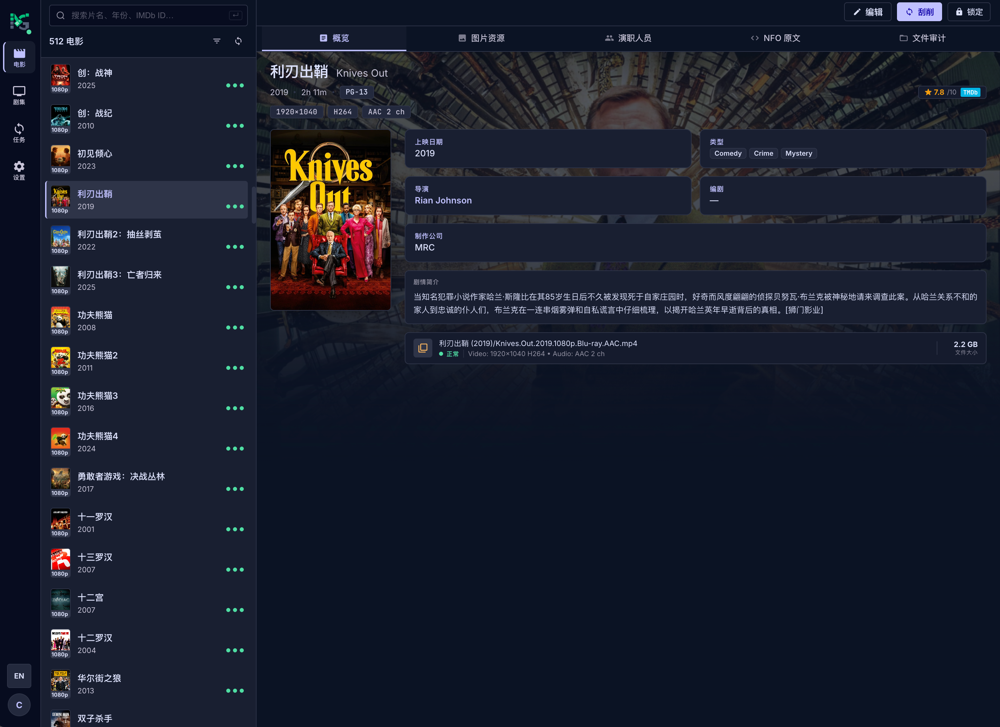

# MediaGrap

[English](README.md) | **简体中文**

面向 NAS 和家庭服务器的轻量、自托管**电影与电视剧元数据管理器**。通过桌面浏览器或移动 PWA 扫描已挂载的媒体库、匹配信息、检查文件，并管理 Kodi NFO 和图片资源。它不是播放器、下载器或转码服务。



## 当前能力

- 电影目录及「剧 → 季 → 集」目录；发现已有 NFO 与本地图片。
- TMDb 匹配、元数据编辑、可选 Fanart.tv 图片和带缓存的 ffprobe 检查。
- NFO/图片写入计划、电影/电视剧重命名预览与后台执行、作业及审计记录。
- 定时扫描、Provider 代理、Webhook 和按来源授权的 MCP 自动化；自动化电影文件写入需网页审批。
- 中英文界面、明暗/跟随系统主题、响应式 PWA；非 root 单容器，Go 服务内嵌 Vue，使用 SQLite WAL。

项目仍在早期开发中；目前没有自动备份恢复或跨文件全局回滚。详见[使用与限制](docs/usage.md)和[路线图](docs/roadmap.md)。

## Docker 快速体验

使用 `cynosure159/mediagrap:latest` 快速启动，或参考[源码构建流程](docs/distribution.md)。生产部署建议固定已审查的版本或镜像摘要。

**首次启动风险：**任何最先访问未初始化实例的人都能创建管理员。请先在可信、隔离的宿主机与容器网络完成初始化，再开放给其他用户或公网代理。回环端口映射只能缩小宿主机暴露面，不能阻止直接从容器网络访问；应用尚无初始化令牌。

在 Linux Docker 宿主机上，仅为应用创建专用状态目录：

```sh
sudo install -d -m 0750 -o 65532 -g 65532 runtime/config runtime/cache
```

将 `/srv/media` 替换为已存在的媒体库目录；初次评估使用只读挂载：

```sh
docker run -d --name mediagrap --restart unless-stopped \
  --security-opt no-new-privileges:true \
  -p 127.0.0.1:8080:8080 \
  -e MEDIAGRAP_CONFIG_DIR=/config \
  -e MEDIAGRAP_CACHE_DIR=/cache \
  -e MEDIAGRAP_MEDIA_ROOTS=/media \
  --mount type=bind,src="$(pwd)/runtime/config",dst=/config \
  --mount type=bind,src="$(pwd)/runtime/cache",dst=/cache \
  --mount type=bind,src=/srv/media,dst=/media,readonly \
  cynosure159/mediagrap:latest
```

在 Docker 宿主机打开 <http://127.0.0.1:8080> 并创建管理员。远程 NAS 请使用可信 SSH 隧道或其他隔离访问方式。不要以 root 运行应用，也不要递归修改媒体所有权。NAS ACL/SELinux 可能需要额外设置；UID/GID **65532** 需要状态目录读写权限和媒体目录读取/遍历权限。

| 容器路径 | 用途 |
| --- | --- |
| `/config` | 持久化数据库、设置、会话、作业及审计；属于敏感数据 |
| `/cache` | 可丢弃的缓存与临时数据 |
| `/media` | 显式挂载的媒体；设置中的来源路径必须位于启动时的允许列表内 |

部署到可信 HTTPS 终止代理后方时，设置 `MEDIAGRAP_SECURE_SESSION_COOKIE=true`，并限制只有该代理能访问后端。浏览器使用普通 HTTP 时不要开启。详见[部署、TLS、权限与排错](docs/deployment.md)。

## 第一个媒体库

1. 在**设置 → 媒体来源**添加容器路径 `/media`，而不是宿主机路径 `/srv/media`。挂载和允许列表不会自动创建来源。
2. 扫描来源。扫描只更新数据库索引，不改写媒体/NFO，也不自动刮削。
3. 打开**电影**或**电视剧**，选择项目，在概览、艺术图、演职员、NFO 原文和文件审计中检查数据。已保存元数据优先于外部 NFO 改动。
4. 需要匹配时再到设置配置 Provider Key。**选择 TMDb 候选会替换元数据并立即写入 NFO，不是只读预览。**电视剧匹配可能写入多个 NFO；只读评估请勿执行此动作。
5. 准备写入前先备份 sidecar，再以可写媒体挂载重建容器，并只授予必要的文件权限。手动 NFO/图片写入和重命名须检查计划后确认，完成后查看作业/审计。任何操作都不保证全局回滚。

扫描自动刷新会保留编辑中的草稿；目标缺失或可用性不确定时会禁止新写入。但主动导航/刷新页面并不提供持久化草稿存储。详细流程、命名变量与集成说明：[使用指南](docs/usage.md)、[Webhook 与 MCP](docs/integrations.md)。

## 升级与备份

停止容器，备份**整个配置目录**和单独挂载的 Webhook 主密钥；媒体旁的 NFO/图片需另行备份。不要仅复制运行中的 `mediagrap.db`，已提交数据可能仍在 SQLite WAL 中。保留旧镜像摘要与对应备份；不保证数据库可降级。使用已审查、固定版本/摘要的镜像重建，检查就绪状态和来源后再扫描。详见[备份与升级流程](docs/deployment.md#backup-and-upgrade)。

## 开发与贡献

在本地源码目录中，准备 Go 1.26+、Node 24.15+、npm 11+ 和 Make：

```sh
npm --prefix web ci
go mod download
MEDIAGRAP_LISTEN=127.0.0.1:8080 npm run dev
```

Vite 会打印浏览器地址并代理到 Go API，状态保存在已忽略的 `.local/`。测试仅使用合成媒体。原生开发构建不等于完整发布包。[开发与贡献](docs/development.md) · [架构与 UI 规范](docs/architecture.md) · [安全与问题报告](docs/security.md)。

## 许可证与对应源码

当前项目采用 [AGPL-3.0-only](LICENSE)。第三方作品与 Provider 内容保留各自条款；这不表示所有历史提交已重新授权。当前发行构建通过界面的 **Download source / 下载源码** 和无需登录的 `/source` 跳转到 [GitHub Releases](https://github.com/Cynosure159/MediaGrap/releases) 上固定版本、完整提交和架构的对应源码资产，不再将大型源码归档嵌入运行镜像。缺少有效内置链接的原生开发构建返回 503。详见[源码、构建与发布说明](docs/distribution.md)及[上游法律材料](docs/legal/README.md)。CI 的 dev 渠道为 `preview` / `preview-<完整提交>`；只有位于 main 最新提交的正式版本标签可发布版本镜像和 `latest`。具体发布门禁见上述说明。
